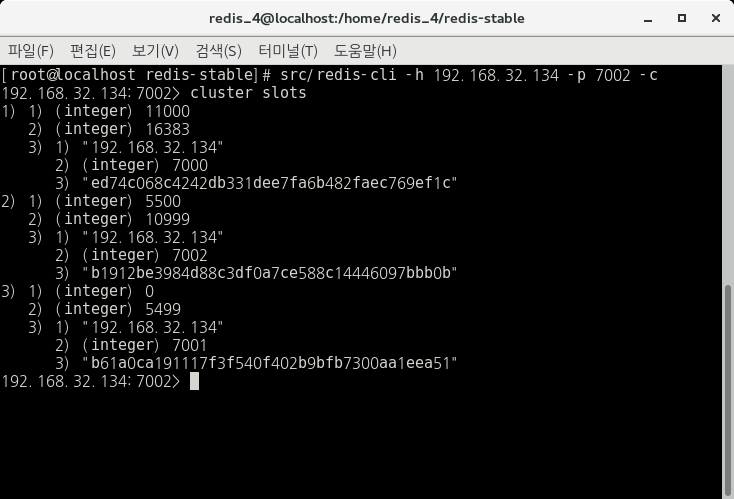

## 2. Keys(Data) Distribution Model

\* key값에 따라 할당되는 Node를 알아보자.

key 공간으로 16384개의 Slot이 사용되고, 해당 Slot이 분할되어 각 노드에 설정된다.

각 노드의 Slot은 아래의 명령어를 통해 확인할 수 있다.

    127.0.0.1:7000 > cluster slots

아래의 결과 화면은 한 slot의 예제이다.

 
    
 

위 사진의 Slot을 확인해보면, 1번 노드는 11000 ~ 16383, 2번 노드는 5500 ~ 10999, 3번 노드는 0 ~ 5499 slot의 범위를 갖는 것을 확인할 수 있다.

이렇게 각 노드에 사용되는 Slot이 할당되게 되고, 해당 Slot에 따라 Key(Data)가 분배된다.

Key(Data)가 특정 Slot에 분배되는 방식은 아래와 같다.

__HASH_SLOT = CRC16(Key) mod 16384__

이때, CRC16은 아래와 같이 지정된다.

- Name : XMODEM (ZMODEM or CRC-16/ACORN)

- Width : 16 bit

- Poly : 1021 (x^16 + x^12 + x^5 + 1)

- Initailization : 0000

- Reflect Input byte : False

- Xor constant to output CRC : 0000

- Output for "123456789" : 31C3

Jedis 에서 사용되는 CRC16은 [JedisClusterCRC16.java](https://github.com/xetorthio/jedis/blob/master/src/main/java/redis/clients/jedis/util/JedisClusterCRC16.java) 에서 확인할 수 있다.

reference by redis(Overview of Redis Cluster main components of [Redis Cluster Specification](https://redis.io/topics/cluster-spec))