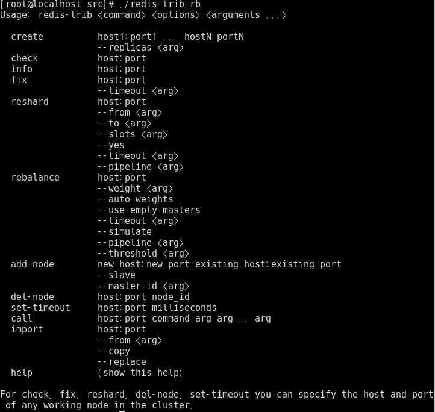

## 1. Redis Cluster Settings 요약

**2. Redis Cluster Setting 의 내용을 간단하게 요약한 문서이다.**

Redis Cluster를 진행할 때는 [RedisGate Cluster Configuration](http://redisgate.kr/redis/cluster/cluster_configuration.php)을 참고하였다.

redis-trib.rb를 통해 cluster작업을 하기 위해 해야할 세팅들이 있다.

1. ruby 설치
    
        yum install ruby

    ruby를 설치 한 후 redis-trib.rb를 실행하면 에러가 발생한다. require~~ 이었던 것 같다.
    이를 해결하기 위해 Redis DB 그룹에서 해결 방법을 찾았다.

2. rubygem 설치
    
    [RedisGem](https://rubygems.org/pages/download)을 보고 setup.rb를 설치하면 된다.

3. gem install redis

    gem을 통해 redis를 설치하려고 하는데, ruby 버전과 맞지 않아 오류가 발생하였다.
    에러 문구를 보고 적절한 ruby버전을 설치하니 해결이 되었다.
    ruby 버전 변경은 [tecadmin](https://tecadmin.net/install-ruby-2-2-on-centos-rhel/) 을 참고하니 바로 되었다.

4. 실행 확인

    cli를 통해 redis-trib.rb 실행 시 아래와 같은 결과화면을 얻을 수 있었다.

     
    
     

명령어 LIST 정리

    $ yum install ruby

    $ gem update --system

    $ get install rubygems-update

    $ update-rubygems

    $ yum install gcc-c++ patch readline readline-devel zlib zlib-devel

    $ yum install libyaml-devel libffi-devel openssl-devel make

    $ yum install bzip2 autoconf automake libtool bison iconv-devel sqlite-devel

    $ curl -sSL https://rvm.io/mpapis.asc | gpg --import - # curl -L get.rvm.io | bash -s stable

    $ source /etc/profile.d/rvm.sh # rvm reload

    $ rvm requirements run

    $ rvm install 2.2.4

    $ rvm use 2.2.4 --default

    $ ruby setup.rb

    $ gem install redis