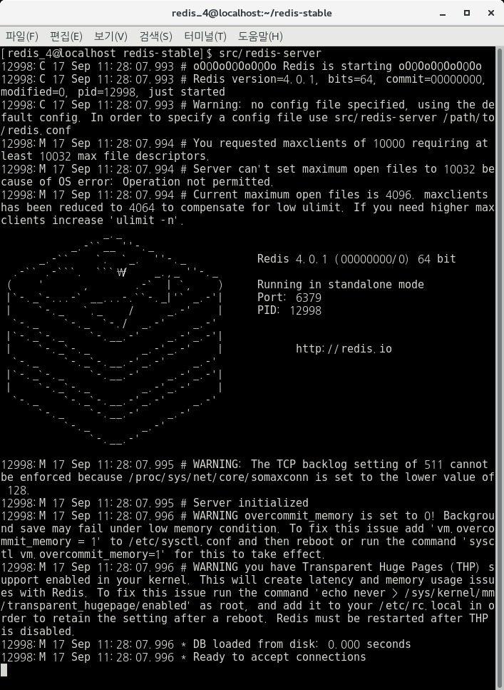
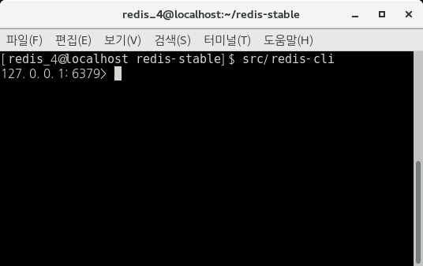

# 1. Redis Install & Run

\* 별도의 언급이 없는 한 모든 작업은 /home/redis_4/redis-stable 경로에서 이루어진다. 

우선 redis-stable 파일을 설치해준다. ([download](https://redis.io/download))

나는 /home/redis_4/에 redis-stable 폴더를 넣었다. (/home/redis_4/redis-stable)

설치 후 폴더를 넣었다면, 아래 명령어를 실행해보자.

    $ src/redis-server

아래와 같은 화면이 뜨면 성공이다. 기본 port는 6379로 설정되어있다.

 

 redis-server를 실행했다면, 해당 서버에 접속해 보자. 다른 terminal을 실행 또는 redis-server를 background로 실행시킨 후 아래와 같은 명령어를 실행해보자.

    $ src/redis-cli

아래와 같이 접속이 된다면 성공한 것이다.

 

 위와 같이 접속한 상태에서 [redisgate](http://redisgate.jp/redis/introduction/redis_intro.php) 를 보고 command 들을 연습하면 된다.