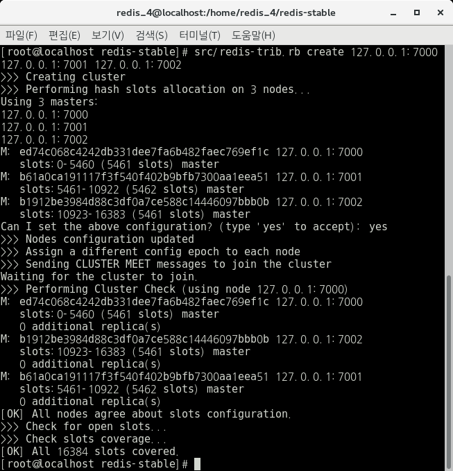
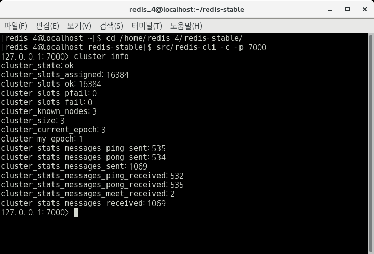
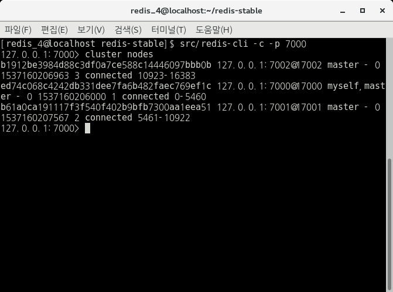
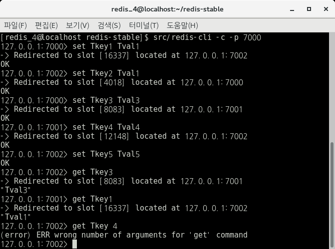

# 3. Start (Single Machine) Redis Cluster reference by [Cluster Start of RedisGate](http://redisgate.kr/redis/cluster/cluster_start.php)

\* 이전과 동일하게 /home/redis_4/redis-stable 경로에서 작업한다.

\* 7000 / 7001 / 7002 port에 대해 Cluster를 진행한다.

\* 아래에서 사용하는 "127.0.0.1:7000 >" 은 Redis cli에서의 명령어 사용을 의미한다. IP와 PORT는 접속하는 Server에 따라 다르다.

**(Single Machine) Redis Cluster의 목표는 7000 / 7001 / 7002 port의 server를 하나의 컴퓨터에서 Cluster하는 것이다.**

## 3.1 7000 / 7001 / 7002 폴더 생성

아래 명령어를 통해 3개의 폴더를 생성해주자.

    $ mkdir 7000 7001 7002

## 3.2 redis.conf 파일 수정 및 복사

폴더를 생성했다면,  /home/redis_4/redis-stable 에 있는 redis.conf파일을 해당 폴더로 복사한다.

이 때, redis.conf 파일의 내용을 아래와 같이 수정한다.

\* 아래 명령어를 통해 vim으로 수정 가능하다.

    $ vi redis.conf

 vim 에디터에서 아래 명령어를 통해 텍스트 검색을 하면 된다.

    $ esc + :/[검색 내용]

 수정 내용들을 찾아 아래와 같이 변경하자.
 \* 추가적인 내용은 [2. Redis Config Settings 요약](../0.%20Reference%20Documents/2.%20Redis%20Config%20Settings%20요약/README.md)을 참고하면된다.

    port [포트번호]                     ->         ex) port 7000

    cluster-enabled yes                    

    cluster-config-file nodes.conf     

    cluster-node-timeout 3000         

    appendonly yes                          

    dir [conf 파일 디렉토리]            ->         ex) dir /home/redis_4/redis-stable/7000

 

수정 후 아래와 같이 redis.conf파일을 저장하자.

    $ esc + :wq

## 3.3 포트별 Redis Server 실행 및 Cluster 생성

아래의 명령어를 통해 port별 3개의 Redis Server를 실행시켜주자. 
    
    $ src/redis-server 7000/redis.conf
    $ src/redis-server 7001/redis.conf
    $ src/redis-server 7002/redis.conf

3개의 서버가 실행되었다면, 아래의 명령어를 통해 Cluster를 생성해보자. 

    $ src/redis-trib.rb create 127.0.0.1:7000 127.0.0.1:7001 127.0.0.1:7002

해당 명령어를 실행하면 아래와 같은 결과가 나오게된다. (실행 중 입력은 yes를 입력해주자.)

 

 
\* 만약 "..." 이 반복해서 생긴다면, 연결하려는 port와 해당 port + 10000번째 port가 방화벽에 막혀있지 않은지 확인해주면된다.

## 3.4 Cluster 정보 확인 및 테스트

아래 명령어를 통해 cli에 접속해보자.

    $ src/redis-cli -c -p 7000

접속을 한 후 아래 명령어들을 통해 Cluster를 확인해보자.

    127.0.0.1:7000> cluster info
    127.0.0.1:7000> cluster nodes

 
 
 
 

실행 결과 위와 같은 결과화면이 나올 것이다.

Cluster 결과를 확인해봤다면, 해당 Redis Server에 데이터를 넣어보자.

 
 

위 사진과 같이 여러개의 Redis Server에 데이터들이 분산되어 들어가는 것을 확인할 수 있다.