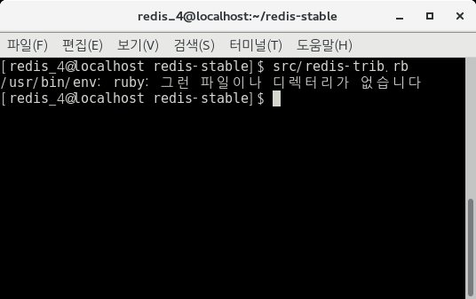
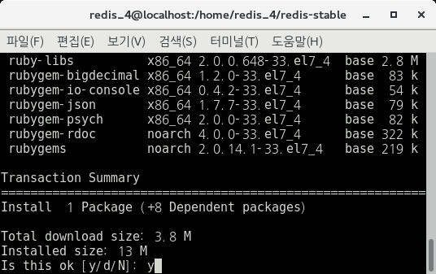
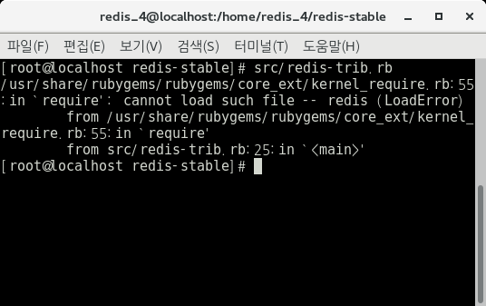
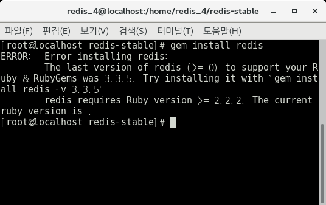

# 2. Redis Cluster Settings

\* 별도의 언급이 없는 한 모든 작업은 /home/redis_4/redis-stable 경로에서 이루어진다.

**Redis Cluster Settings의 목표는 아래의 명령어가 실행되도록 하는 것이다.**

Redis Cluster를 시작하기 위해서 redis-trib.rb를 실행해야 한다.
아래의 명령어를 통해 실행해보자.

    $ src/redis-trib.rb

 

 
만약 Ruby가 없다면 위와 같은 Error Message가 나타날 것이다. 이것은 ruby가 설치되어있지 않아서 발생하는 문제이니 ruby를 설치해보자. 

  

## 2.1 Ruby Install

아래 명령어를 통해 ruby를 설치해주자. 

ps. 설치 부분은 root 권한이 필요할 수 있으니 참고

    $ yum install ruby

만약 아래와 같은 문구가 나오면 y를 입력해주자.

 

 설치가 끝났다면 다시 아래와 같이 명령어를 작성해보자.

    $ src/redis-trib.rb

 

 여전히 Error가 발생한다.

  

## 2.2 Ruby Gem Install reference by Dipak Bhimani's commants of [Redis DB](https://groups.google.com/forum/#!topic/redis-db/YoF7s4L-AK8)

우선 오른쪽 사이트에서 rubygem을 다운로드한 후 압축을 풀어준다. ([RubyGems](https://rubygems.org/pages/download))

이후 아래의 명령어를 통해 rubygem을 설치한다.

    $ gem update --system
    $ gem install rubygems-update
    $ update_rubygems

위 3개의 명령어 실행이 완료되면, 압축을 푼 폴더 내의 setup.rb 파일을 통해 설치해준다. 설치는 아래의 명령어를 통해 가능하다.

    $ ruby setup.rb

설치 후 아래의 명령어를 실행해보자.

    $ gem install redis

 

 해당 명령어를 실행해보니, Ruby version이 2.2.2 이상이어야 한다고 나온다.

그러면 Ruby의 버전을 update 해보자.