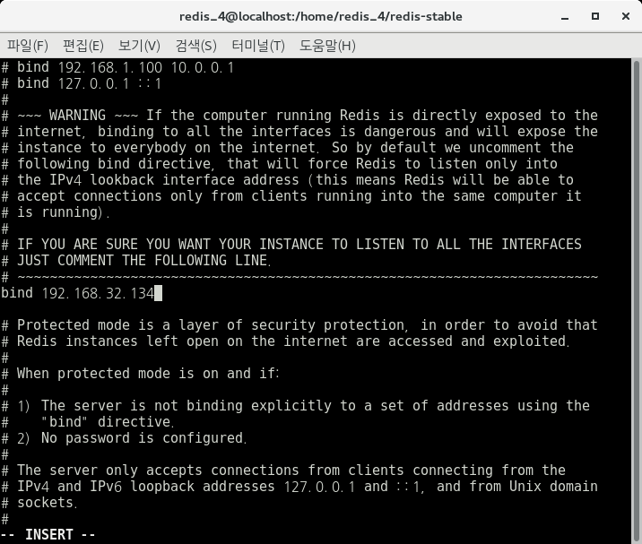
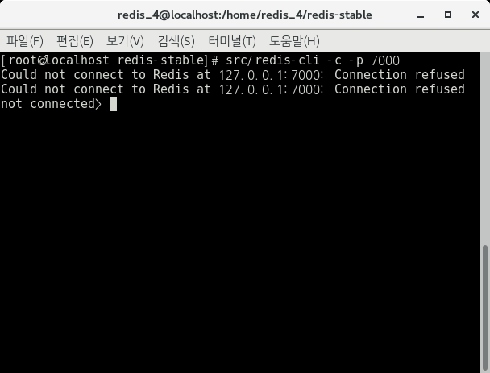
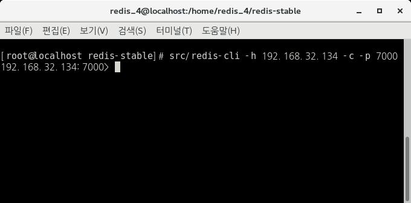
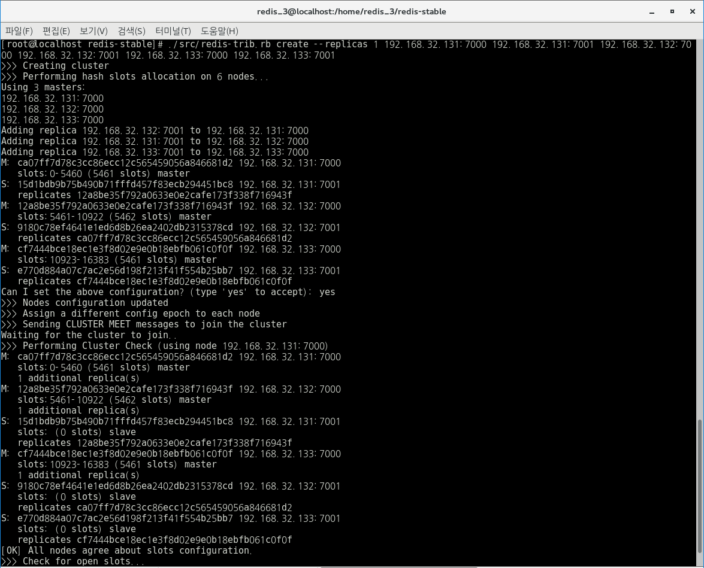
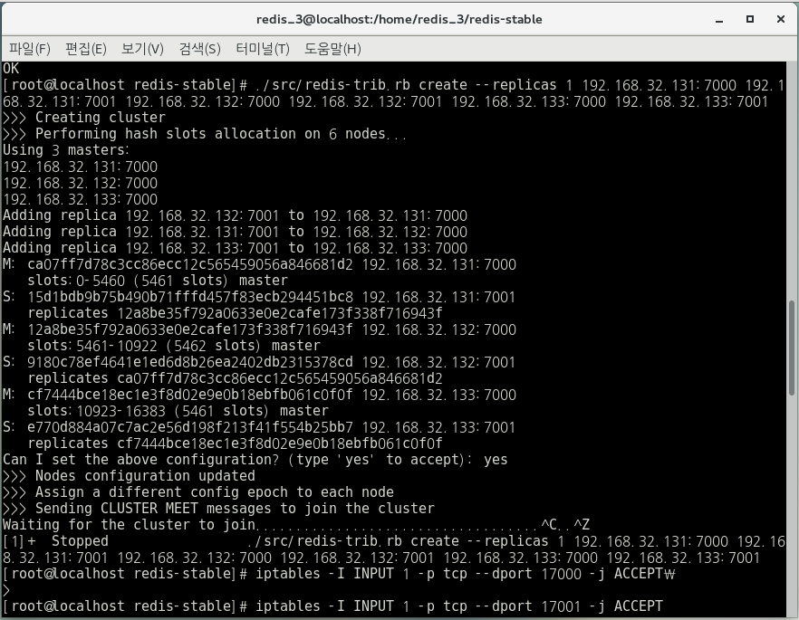

# 4. Start (Multy Machine) Redis Cluster reference by [Cluster Redis-trib.rb of RedisGate](http://redisgate.kr/redis/cluster/redis-trib.php)

\* 3개의 CentOS(Machine)와 redis 설정을 한 이후 진행하면 된다.

\* [3. Start (Single Machine) Redis Cluster](https://github.com/seong954t/RedisStudy/tree/master/3.%20Start%20(Single%20Machine)%20Redis%20Cluster)에서 한 절차와 동일하게 각 Machine(컴퓨터)에서 7000 / 7001 폴더 생성 후 redis.conf를 설정해준다.

\* 별도의 언급이 없는 한 모든 작업은 /home/redis_4/redis-stable 경로에서 이루어진다.

**(Multy Machine) Redis Cluster의 목표는 3개의 독립적인 Machine을 Cluster하여 Cluster의 데이터 저장이 어떻게 되는지 테스트하는 것이다.**

## 4.1 IP Bind 설정

아래 명령어를 통해 자신의 IP를 확인한다.

    $ ifconfig

 

 
나의 IP는 192.168.32.134라는 것을 확인하였다.

확인 후 아래 사진과 같이 기존 7000 / 7001 폴더 내 redis.conf 파일에서 bind를 수정해준다.

 

 
이 작업은 총 3개의 Machine(컴퓨터) 모두 이루어져야한다. 한 Machine(컴퓨터) 당 2개의 port이니 총 6개의 redis.conf 파일을 수정해야한다. IP 또한 각 Machine마다 확인 후 변경하면 된다.

conf 파일 수정 후 아래와 같은 명령어를 통해 총 6개의 Server를 실행시키자. (한 IP 당 2개의 port로 총 3개의 IP 사용)

    $ src/redis-server 7000/redis.conf
    $ src/redis-server 7001/redis.conf

위와 같이 새롭게 IP를 Bind 한 후 cli 접속을 해보면, localhost(127.0.0.1)의 접속이 아니기 때문에 아래와 같이 Error가 발생한다

 

 

그래서 설정한 IP로 접속하기 위해 아래의 명령어를 사용하면 접속이 된다.

    $ src/redis-cli -h [접속할 IP] -c -p [접속할 PORT]
    $ src/redis-cli -h 192.168.32.134 -c -p 7000

위와 같은 명령어를 실행하면 기존 127.0.0.1:7000 > 으로 보이던 부분이 192.168.32.134:7000 > 으로 아래와 같이 보이게된다.

 

 

## 4.2 PORT 개방하기

현재 7000 / 7001 port를 사용하고 있으니 Redis를 사용하기 위해 7000 / 17000 / 7001 / 17001 port를 아래의 명령어를 통해 개방해주자.

    $ iptables -I INPUT 1 -p tcp --dport [포트번호] -j ACCEPT

    $ iptables -I INPUT 1 -p tcp --dport 7000 -j ACCEPT
    $ iptables -I INPUT 1 -p tcp --dport 17000 -j ACCEPT
    $ iptables -I INPUT 1 -p tcp --dport 7001 -j ACCEPT
    $ iptables -I INPUT 1 -p tcp --dport 17001 -j ACCEPT

ps)

삭제는 
    
    $ iptables -D INPUT -p tcp --dport [포트번호] -j ACCEPT 

를 통해 한다.

해당 port iptable 확인은 

    $ netstat -nap | grep [포트번호] 

또는 

    $ iptable -nL 

을 통해 확인한다.

위와 같이 설정이 끝나면 아래와 같은 일을 수행할 수 있다.

IP가 192.168.32.131 인 Machine(컴퓨터) 에서 
    
    $ src/redis-cli -h [IP] -c -p [포트번호]
    $ src/redis-cli -h 192.168.32.134 -c -p 7000 

명령어를 통해 IP가 192.168.32.134인 다른 Redis 서버에 접속하여 Redis 명령어를 수행할 수 있다.

## 4.3 Redis Cluster 하기

\* 나는 192.168.32.131 / 192.168.32.132 / 192.168.32.133 IP의 7000 / 7001 port를 사용했다.

아래의 명령어를 통해 1 Master - 1 Slave 의 구조 3개를 구성하였다.

 

    $ src/redis-trib.rb create --replicas 1 192.168.32.131:7000 192.168.32.131:7001 192.168.32.132:7000 192.168.32.132:7001 192.168.32.133:7000 192.168.32.133:7001
  
실행 결과 아래와 같은 결과화면을 볼 수 있다.

 

 
만약 아래와 같은 사진이 나온다면 4-2의 port 개방이 제대로 이루어지지 않았을 수 있으니 확인 후 다시 진행하면 된다.

 