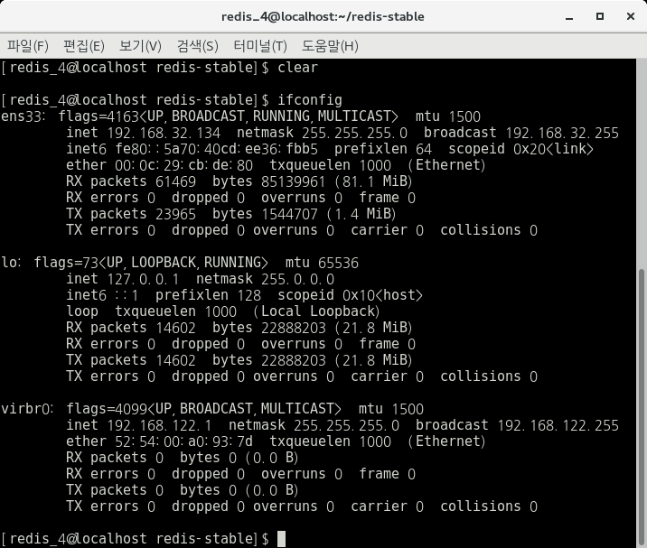

# 4. Start (Multy Machine) Redis Cluster reference by [Cluster Redis-trib.rb of RedisGate](http://redisgate.kr/redis/cluster/redis-trib.php)

\* 3개의 CentOS(Machine)와 redis 설정을 한 이후 진행하면 된다.

\* [3. Start (Single Machine) Redis Cluster](https://github.com/seong954t/RedisStudy/tree/master/3.%20Start%20(Single%20Machine)%20Redis%20Cluster)에서 한 절차와 동일하게 각 Machine(컴퓨터)에서 7000 / 7001 폴더 생성 후 redis.conf를 설정해준다.

\* 별도의 언급이 없는 한 모든 작업은 /home/redis_4/redis-stable 경로에서 이루어진다.

**(Multy Machine) Redis Cluster의 목표는 3개의 독립적인 Machine을 Cluster하여 Cluster의 데이터 저장이 어떻게 되는지 테스트하는 것이다.**

## 4.1 IP Bind 설정

아래 명령어를 통해 자신의 IP를 확인한다.

    $ ifconfig

 

 
나의 IP는 192.168.32.134라는 것을 확인하였다.

확인 후 아래 사진과 같이 기존 7000 / 7001 폴더 내 redis.conf 파일에서 bind를 수정해준다.

 

 
이 작업은 총 3개의 Machine(컴퓨터) 모두 이루어져야한다. 한 Machine(컴퓨터) 당 2개의 port이니 총 6개의 redis.conf 파일을 수정해야한다. IP 또한 각 Machine마다 확인 후 변경하면 된다.

conf 파일 수정 후 아래와 같은 명령어를 통해 총 6개의 Server를 실행시키자. (한 IP 당 2개의 port로 총 3개의 IP 사용)

    $ src/redis-server 7000/redis.conf
    $ src/redis-server 7001/redis.conf

위와 같이 새롭게 IP를 Bind 한 후 cli 접속을 해보면, localhost(127.0.0.1)의 접속이 아니기 때문에 아래와 같이 Error가 발생한다

 

 

그래서 설정한 IP로 접속하기 위해 아래의 명령어를 사용하면 접속이 된다.

    $ src/redis-cli -h [접속할 IP] -c -p [접속할 PORT]
    $ src/redis-cli -h 192.168.32.134 -c -p 7000

위와 같은 명령어를 실행하면 기존 127.0.0.1:7000 > 으로 보이던 부분이 192.168.32.134:7000 > 으로 아래와 같이 보이게된다.

 

 