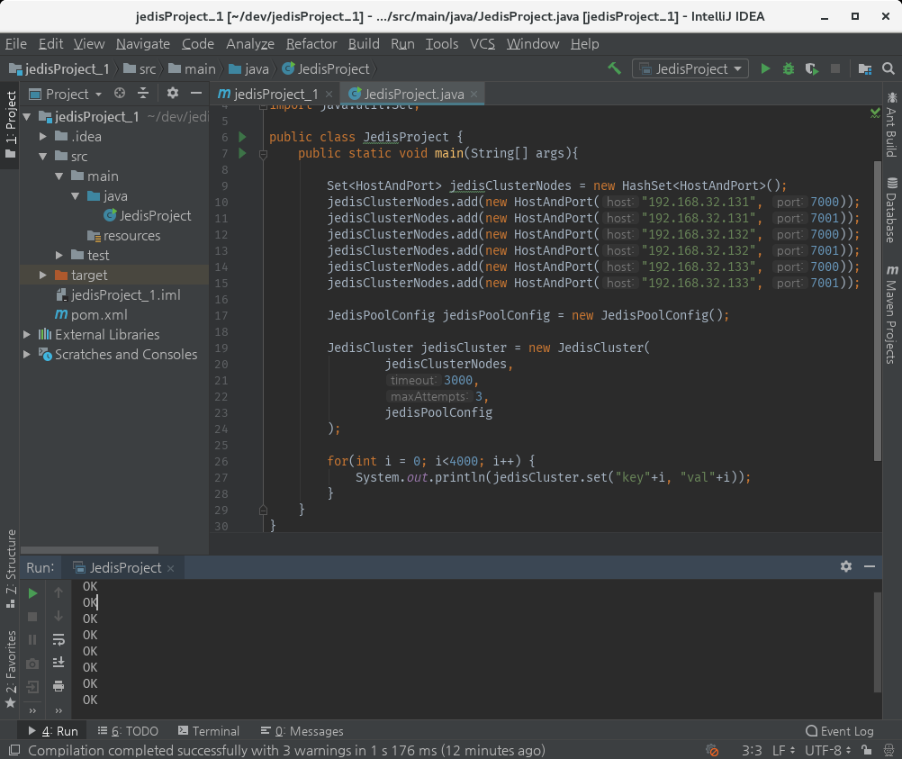
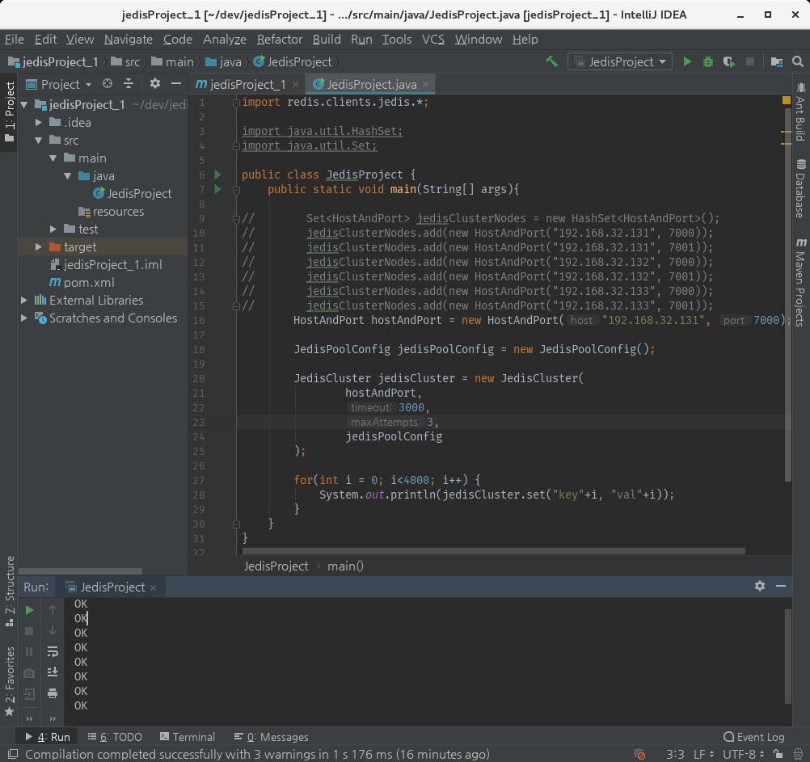
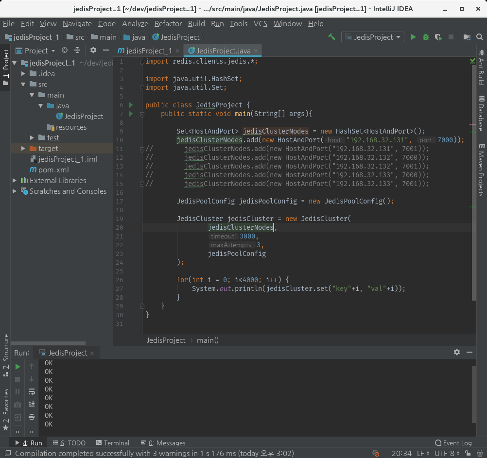

# 5. Jedis 실행해보기

**Java를 통해 Redis를 Control할 수 있는 Jedis를 사용해보는 것이 목표이다.**

우선 아래와 같이 maven dependency의 pom.xml에 아래 내용을 추가시켜 Jedis Library를 추가하였다.

    <dependency>
        <groupId>redis.clients</groupId>
        <artifactId>jedis</artifactId>
        <version>2.9.0</version>
    </dependency>

Library 추가 후 Cluster한 IP와 PORT 정보를 입력하여 Cluster 내용을 설정하고, JedisCluster를 생성하여 Data Set을 실행해보니 아래와 같이 성공적으로 진행되었다.

 

 
그러나 모든 Cluster 된 IP와 PORT를 작성하는 문제가 있어서 찾아본 결과 "Jedis Cluster will attempt to discover cluster nodes automatically" 라고, 알아서 Cluster 정보를 찾는다고 하였다.

그래서 실제로 Cluster 중 하나만 입력 후 Clutser를 아래와 같이 실행해보았다.

 

 

이와 같이 실행해도 아무런 문제없이 Cluster에 잘 분배되어 들어가는 것을 확인하였다.

그러나 위의 방법은 warnings으로 사용되지 않는다고 하여, 우선적으로 아래의 방법을 사용하는 방향을 선택했다.

 

 

이를 통해 간단하게 Jedis를 사용하여 Redis 서버에 접속할 수 있다는 것을 확인해보았다.